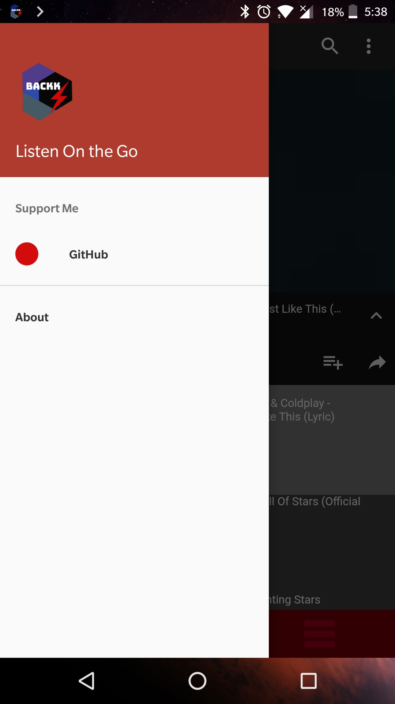
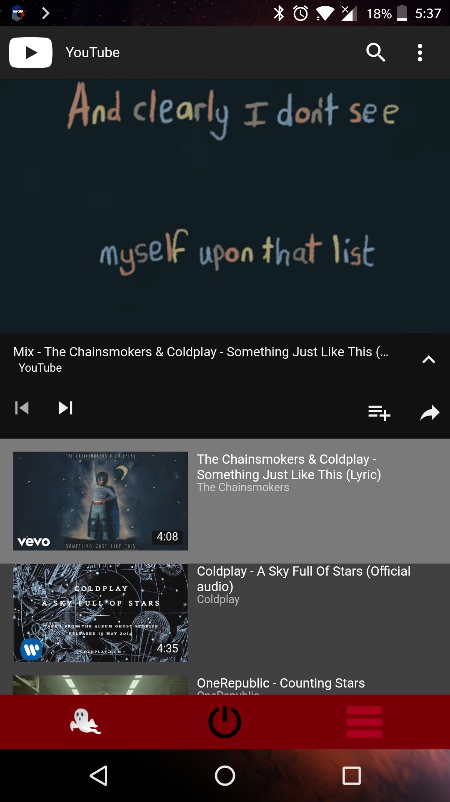
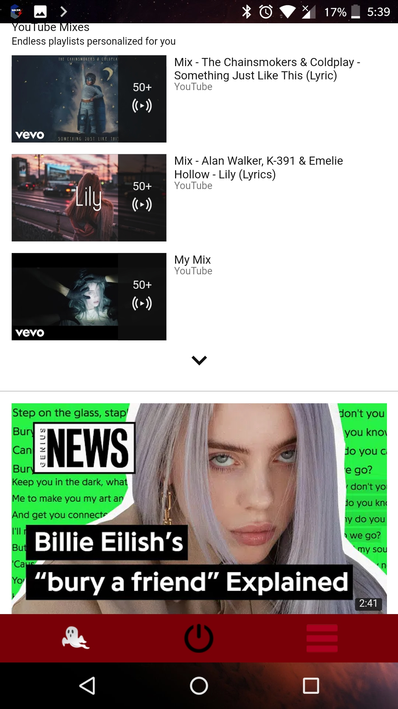
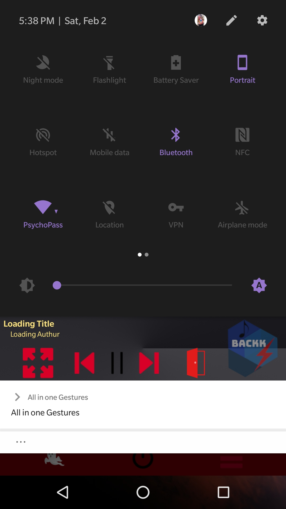

# Play-youtube-in-background
This is an android Application that lets users keep on playing youtube music even after turning screen off. It uses Webview and SYSTEM_OVERLAY

It is an android Application called Backk that lets user play their favorite music platform Youtube as a music player. The main aim of this project was to let youtube keep on playing even after the user navigate back to some other application or even turn off the screen. This provides a feel of music player. The user can listen to their favorite playlists while doing other tasks.

This feature is against YouTube terms of service and could not be present on Google Play Store; therefore, I have developed it just for personal purposes.

Backkk provides mechanisms for searching videos and playlists on YT, as well as logging into a Google account in order to acquire private playlists, which normally cannot be accessed.

**Disclaimer**

This repository contains a code intended to demonstrate the capabilities of the Android Webview and how it can be use with a floating window that overlays on top of oher apps. It is not intended to be used as-is in applications as a library dependency, and will not be maintained as such.

 

  
